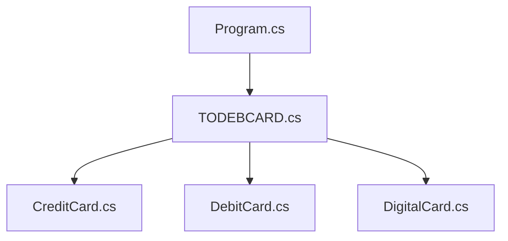

# 2.Hafta_Odevi

**Hello Visitor**

This is the **2nd Task** of the first week which is given by **Patika.Dev TÖDEB Bootcamp**

Abstract Class Definitions and Sample Project via Imaginary TODEBCARD

